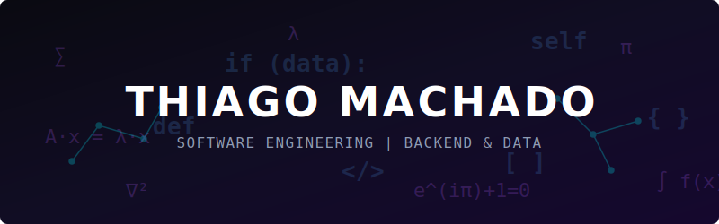

  

  
  

## 📁 Projetos Públicos

| Projeto | Stack | Minha atuação | Repositório |
| :--- | :--- | :--- | :---: |
| **GoStudy** | Django REST | Sistema web acadêmico desenvolvido em equipe. Atuação como Líder do Backend e desenvolvedor. | [acessar](https://github.com/FGA0138-MDS-Ajax/2026.1-T03-Turing) |
